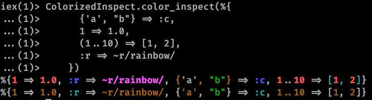

# ColorizedInspect

Provides an inspect that has syntax highlighting.

## Usage



In this example were used the default colors for this library and the shell used the default linux colors.

## Why?

There are times where you are inspecting a biiig data structure, and a bit of syntax highlighting would help.

### Why not use `IO.inspect/2` directly? 

The `IO.inspect/2` function allows you to pass an `:syntax_colors` option that changes
the syntax coloring of the thing you are inspected.
Thing is, I don't want to paste a colorscheme every time I want to inspect something.
So you don't have to 

* Read the deep nested documentation (sometimes it's not even documented. There's no reference to what are the possible keys to the colorscheme list)
* Create a colorscheme 
* Create code so you can reuse the colorscheme

I made this.

## Configuration

If you want to change the colors:

```elixir
config :colorized_inspect,
        [
          number: :red,
          atom: :green,
          regex: :white,
          tuple: :yellow,
          map: :blue,
          list: :magenta
        ]
```

## Installation

If [available in Hex](https://hex.pm/docs/publish), the package can be installed
by adding `colorized_inspect` to your list of dependencies in `mix.exs`:

```elixir
def deps do
  [
    {:colorized_inspect, "~> 1.0.0"}
  ]
end
```

Documentation can be generated with [ExDoc](https://github.com/elixir-lang/ex_doc)
and published on [HexDocs](https://hexdocs.pm). Once published, the docs can
be found at [https://hexdocs.pm/colorized_inspect](https://hexdocs.pm/colorized_inspect).

